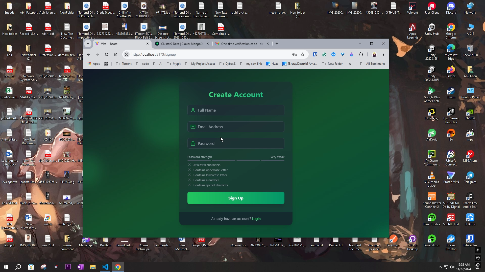
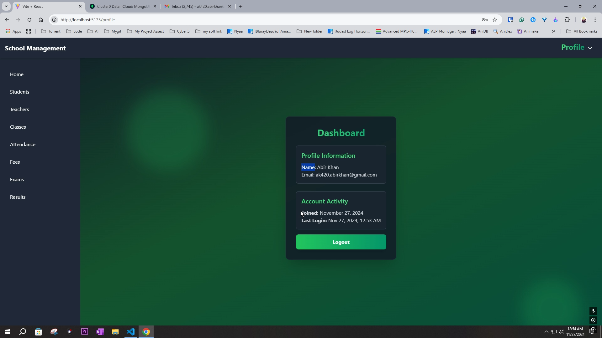
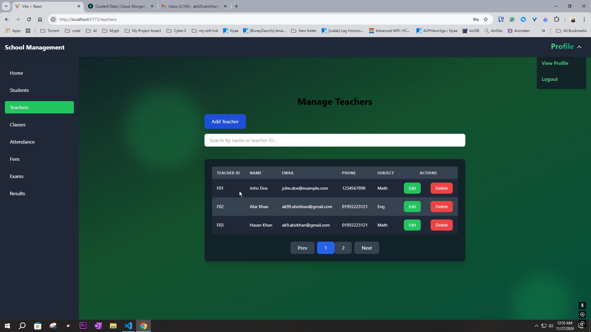
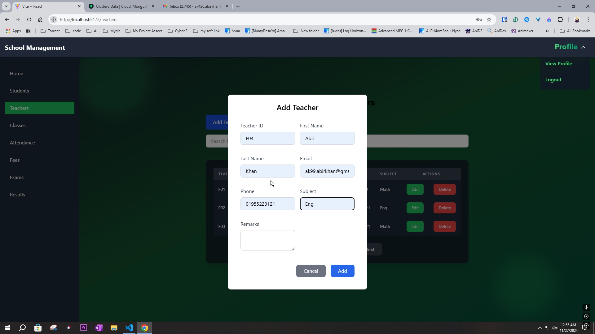
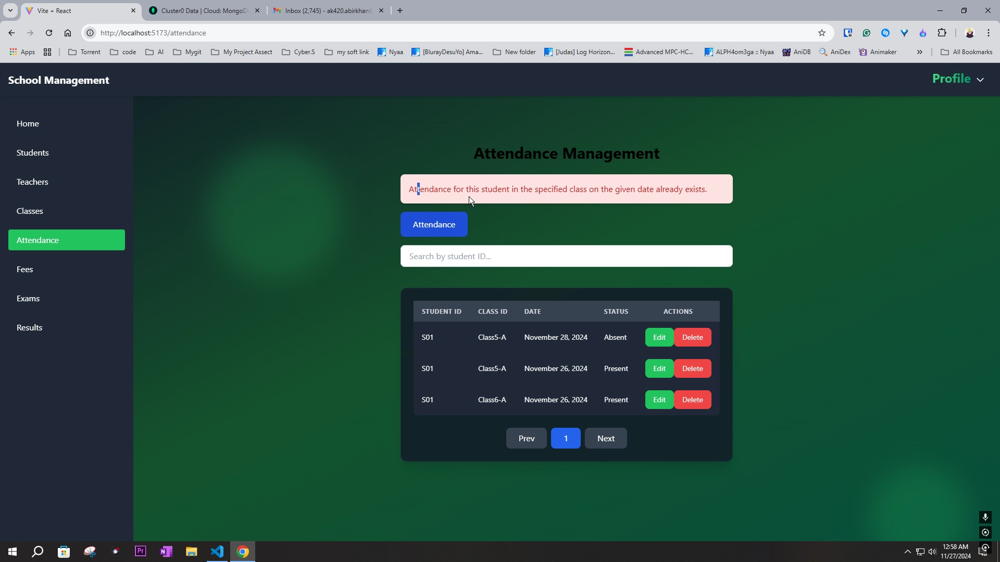
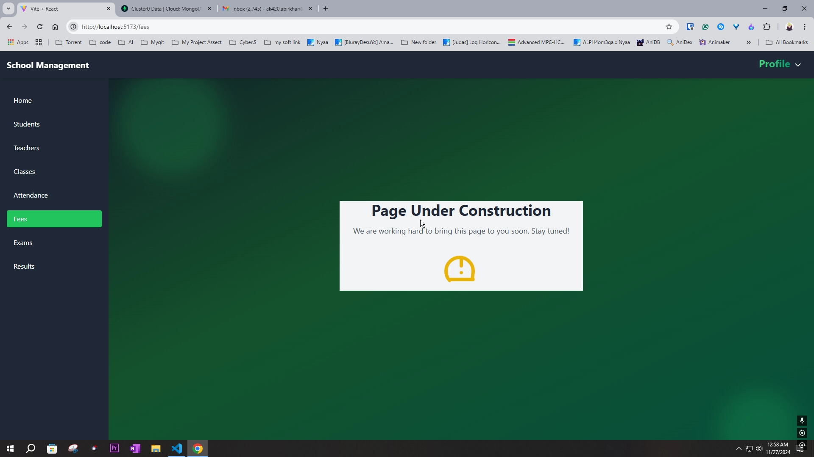

# SMS-assessment (School Management System)

**SMS-assessment** is a comprehensive School Management System built to streamline the management of school activities, including student records, teacher management, grades, schedules, and communication. This application ensures smooth operations for administrators, teachers, and students, while offering easy-to-use functionalities for each user role.

## Table of Contents

- [Features](#features)
- [Technologies](#technologies)
- [Installation](#installation)
- [Environment Variables](#environment-variables)
- [Usage](#usage)
- [Folder Structure](#folder-structure)
- [License](#license)

## Features

- **Student Management**: Add, update, and manage student records, including personal details, grades, and attendance.
- **Teacher Management**: Manage teacher profiles and assignments.
- **Class Scheduling**: Schedule and track class sessions.
- **Grades & Attendance**: Record and track student grades and attendance.
- **User Roles & Permissions**: Admin, Teacher, and Student roles with specific permissions.
- **Notifications**: Real-time notifications for students and teachers.
- **Reports**: Generate reports for student performance, class performance, etc.

## Technologies

### Backend

- **Node.js** with **Express.js**: For handling server requests and managing APIs.
- **MongoDB**: NoSQL database to store school data.
- **JWT (JSON Web Tokens)**: For managing authentication and authorization.
- **Mongoose**: ODM for MongoDB for easier data modeling.
- **NodeMailer**: For email notifications to users.
- **bcryptjs**: For secure password hashing.
- **dotenv**: For environment variables.
- **Axios**: For making HTTP requests from the frontend.

### Frontend

- **React**: For building a dynamic and responsive user interface.
- **Tailwind CSS**: For styling and responsive design.
- **React Router DOM**: For routing between pages.
- **Framer Motion**: For smooth animations and transitions.
- **Zustand**: For state management in React.
- **React Toastify**: For real-time notifications.

## Installation

### Prerequisites

- [Node.js](https://nodejs.org/)
- [MongoDB](https://www.mongodb.com/)

### Backend Setup

1. Clone the repository:

   ```bash
   git clone https://github.com/yourusername/SMS-assessment.git
   cd SMS-assessment/backend
   ```

2. Install backend dependencies:

   ```bash
   npm install
   ```

3. Set up environment variables (see [Environment Variables](#environment-variables)).

4. Start the backend server:

   ```bash
   npm start
   ```

### Frontend Setup

1. Navigate to the frontend directory:

   ```bash
   cd ../frontend
   ```

2. Install frontend dependencies:

   ```bash
   npm install
   ```

3. Set up environment variables (see [Environment Variables](#environment-variables)).

4. Start the frontend development server:

   ```bash
   npm start
   ```

The app will run on `http://localhost:3000` by default.

## Environment Variables

To run this project, you will need to add the following environment variables to a `.env` file in both the `backend` and `frontend` directories.

### Backend `.env`

```plaintext
# Server port
PORT=5000

# MongoDB URI
MONGO_URI=your_mongodb_uri

# JWT Secret
JWT_SECRET=your_jwt_secret

# Mailtrap configuration (or other mail service)
MAILTRAP_USER=your_mailtrap_user
MAILTRAP_PASSWORD=your_mailtrap_password

NODE_ENV=development

CLIENT_URL=http://localhost:3000
```

### Frontend `.env`

```plaintext
# API server URL (backend)
VITE_BACKEND_URL=http://localhost:5000

# JWT secret for encryption/decryption (optional)
VITE_JWT_SECRET=your_jwt_secret

# Client URL
VITE_CLIENT_URL=http://localhost:3000

# Node environment
VITE_NODE_ENV=development
```

## Usage

1. Register a new account via the registration form.
2. Admin can manage student and teacher records.
3. Teachers can manage student grades and attendance.
4. Students can view their grades, attendance, and schedule.
5. Notifications and alerts are provided for important actions.

## Folder Structure

```plaintext
SMS-assessment/
│
├── backend/
│   ├── controllers/      # API logic
│   ├── db/               # MongoDB connection
│   ├── models/           # Database models
│   ├── routes/           # API routes
│   ├── utils/            # Helper functions
│   ├── index.js          # Main server file
│   └── .env              # Environment variables for backend
│
├── frontend/
│   ├── public/           # Static files
│   ├── src/
│   │   ├── components/   # Reusable components
│   │   ├── pages/        # Pages for different routes
│   │   ├── store/        # Zustand for state management
│   │   ├── styles/       # Tailwind CSS styles
│   │   ├── utils/        # Helper functions
│   │   ├── App.js        # Main React component
│   │   └── main.jsx      # Entry point
│   └── .env              # Environment variables for frontend
│
├── .gitignore
├── README.md
└── package.json
```

### Screenshots







## License

This project is licensed under the MIT License.

---

